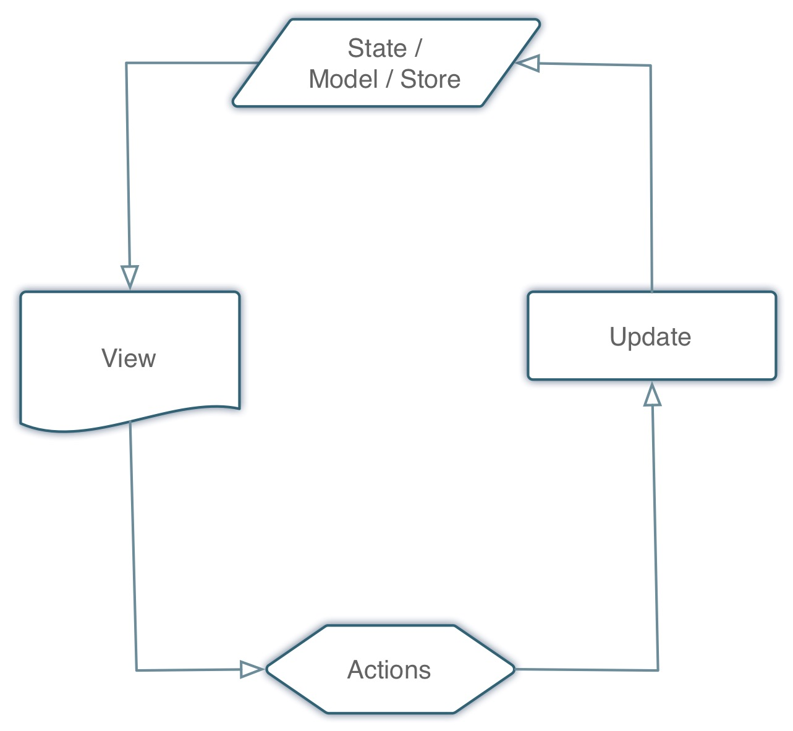
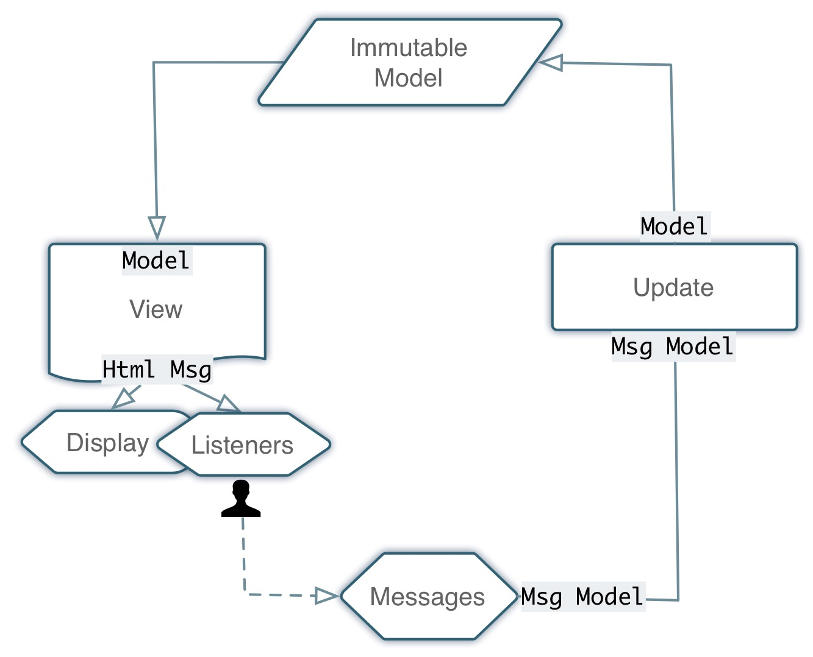
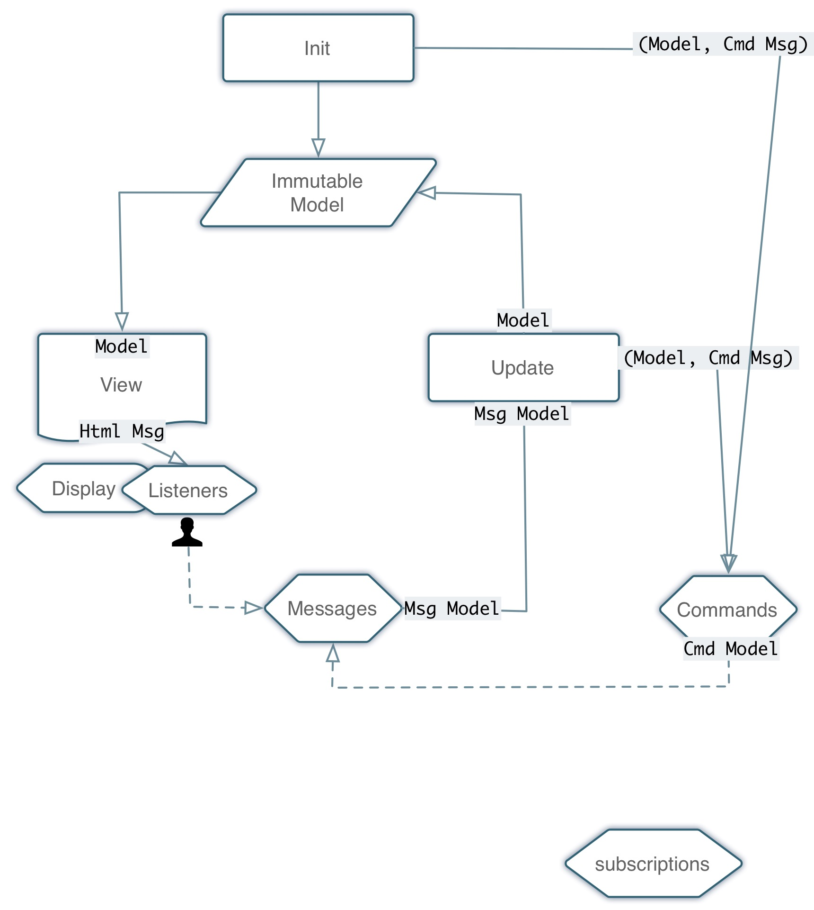

**Elm 0.??**, **please ignore** 

# App Architecture

**Applications** are programs that can actually be run and produce output. 

## ELM-HTML

- blazing fast
- virtual DOM
- lazy rendering

* HTML, CSS, JavaScript interoperability
* Elm Unidirectional Application Architecture (similar concepts as Redux)
* Immutable data structures

---

```elm
import Html exposing ( div, text )
import Html.Attributes exposing ( class )

sampleSection : Html
sampleSection =
    div [ class "section" ] [ text "Section 1" ]
```


## Unidirectional Architectures




### For instance, with React

```javascript
var HelloMessage = React.createClass({
  render: function () {
    return <h1>Hello {this.props.message}!</h1>;
  }
});

React.render(<HelloMessage message="World" />, document.body);

```

## main

Every Elm app calls a `main` function when we run it.

```elm
main = 
  -- something goes here
```

The application doesn't need to declare a module definition in it at all -- but you should for large applications.

However defined, only Main can define ports (a topic otherwise beyond the scope of this guide). The Main module must define a `main` value, whose type is restricted to a handful of things that the compiler can display. Other modules should avoid defining `main`.


## Static content

```elm
import Html

main =
  Html.text "Hello"
```

## Dynamic Content


# Structure of an Elm program

Interactive Elm programs are written following a pattern very similar to the familiar MVC (Model-View-Controller) pattern, as follows

- Model - Something that records the current state of the application. No behavior. Only data. It holds the single source of truth, as to the state of the application.

- Update - Function that manages any change in the state of the application. Think of it as a state engine. It fires whenever a message is received and returns a model.  

- View - The function that renders the view. It is fired whenever the model changes and transforms the model into a UI that people see. Typically, a HTML page. 

### Basic Flow

* Model is initialized
* View is displayed, from model
* Something happens (for instance, as a result of the user actions).
* A Message is dispatched
* The update function reacts to the message
* New model is created
* New view is rendered


## Beginner Application



### Skeleton

```elm
import Html exposing (..)

-- MODEL - Data structure required for holding the application state.
type alias Model = { ... }


-- UPDATE - Declare all possible application states and how to react to them.
type Msg = Reset | ...

update : Msg -> Model -> Model
update msg model =
  case msg of
    Reset -> ...
    ...

-- VIEW - Visual representation of the current application state
view : Model -> Html Msg
view model =
  ...
```


## Full example

elm-zippopotamus

## Program Application




### Skeleton

```elm
import Html.App as Html

main =
  Html.program
    { init = init, update = update, view = view, subscriptions = \_ -> Sub.none }
```    

(source: [elm-platform - Upgrading to 0.17](https://github.com/elm-lang/elm-platform/blob/master/upgrade-docs/0.17.md))